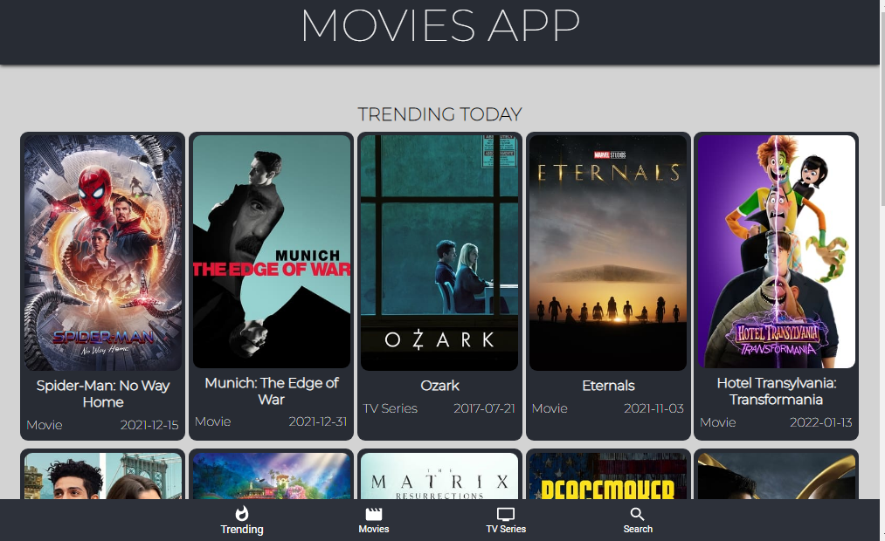

# Movies App

Movies App is built using React Js. It can be used to search about movies and series. And you can watch its trailers as well.



# Tech Used
1. React Js
2. TMDB Api
3. Material UI

# Installation
Clone the repo to your local machine and then in the root folder, perform the command ```npm install```
